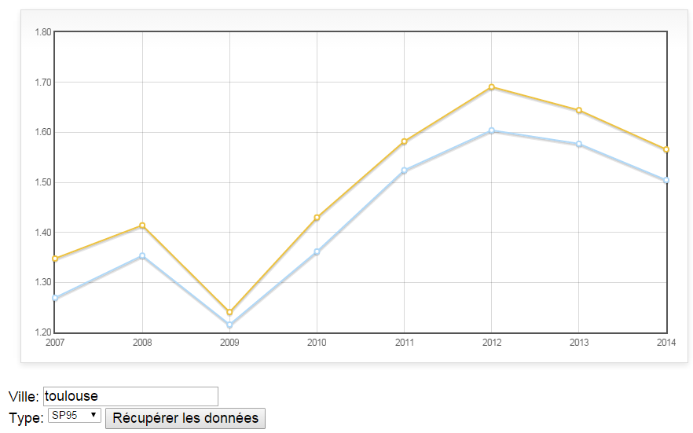
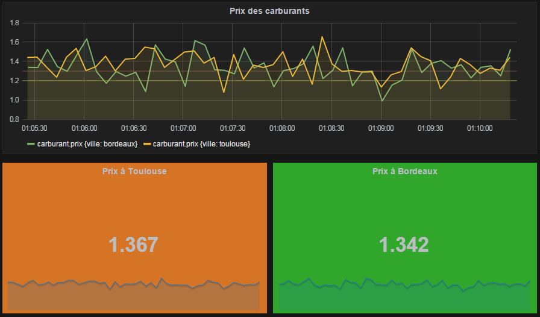

= Déploiement d'une application avec Spring Boot
Stéphane Deraco <stephane.deraco@dsi.cnrs.fr>
JDEV 2015
:toc2:
:numbered:
:toclevels: 5

== Présentation de Spring Boot

=== Un projet Java classique
Une application Java est de nos jours principalement une application
_standalone_ (par exemple un traitement de données en tâche de fond), ou une
application Web (sur un Tomcat, ou un serveur d'application).

Java est très bien outillé pour la mise en oeuvre de telles applications : Maven
et Gradle pour la gestion du cycle de vie, tests unitaires, une multitude de
_frameworks_ divers et variés, des conteneurs pour exécuter les programmes.

Souvent, le démarrage d'un projet Java consiste à faire de la tuyauterie :
mettre en place les différentes librairies communément utilisées, faire
attention aux différentes versions, préparer la configuration d'accès aux bases
de données.

Puis vient la phase de déploiement : dépôt d'un _war_ dans un conteneur ? Ce
_war_ contient-il des jars embarqués, ou faut-il mettre à jour les jars partagés
du Tomcat ? Comment gérer les fichiers de propriétés ? Et la supervision : y
a-t-il des points d'entrées pour surveiller la santé de notre application ?

=== Spring Boot
Spring Boot apporte des solutions à ces problèmes. Avant de voir comment, voyons
déjà ce que Spring Boot n'est pas :

* ce n'est pas un _framework_, du moins pas comme un Spring Security, Guava, ou
  autre
* un générateur de code ; autrement dit, Spring Boot fait partie intégrante du
  projet, y compris lors de l'exécution de l'application
* un outil de maquettage ; il sert à faire des applications complètes (à noter
  que le site http://spring.io/[Spring IO] est un projet réalisé avec Spring
  Boot, dont les sources sont sur ce
  https://github.com/spring-io/sagan[dépôt Github])

Spring Boot simplifie la vie du développeur en :

* utilisant des librairies souvent utilisées, dans des versions cohérentes
* auto-configurant les composants qui sont détectés sur le classpath (par
  exemple, si Spring Boot détecte le driver Java de Mongo, ou un driver JDBC, ou
  Tomcat, etc., alors il configure automatiquement un ensemble de Bean (au sens
  Spring) pour utiliser ces composants)
* permemttant de personnaliser les composants, pour passer outre l'auto-
  configuration
* simplifiant la gestion des propriétés provenant de sources différentes
* exposant des points d'entrées pour la surveillance de l'application
* simplifiant le déploiement (un jar unique, ou un war pour Tomcat)

Ce ne sont là qu'une partie des avantages de Spring Boot. Pour aller plus loin,
consulter les références suivantes :

.Références
* http://docs.spring.io/spring-boot/docs/current-SNAPSHOT/reference/htmlsingle/[Guide de référence Spring Boot]
* La plupart des exemples sur http://spring.io/guides utilisent Spring Boot

== Déroulement de l'atelier
Nous allons créer une application en partant de zéro. Cette application va
récupérer et traiter des fichiers de données, insérer ces données en base Mongo,
puis exposer des services web REST pour interroger ces données.

La configuration de l'application sera mise en place, le déploiement expliqué,
et nous exposerons des services web _techniques_ pour indiquer le statut
opérationnel de l'application (est-ce que la base est OK ? l'espace disque OK ?)

Enfin, nous allons exposer des métriques fonctionnelles, et les grapher.

== Première partie : introduction à Spring Boot
=== Création initiale de l'application
Nous allons créer une application qui permet de récupérer les données provenant
de fichiers sur le prix des carburants. Ces fichiers sont accessibles
publiquement à l'adresse suivante :

http://www.prix-carburants.economie.gouv.fr/rubrique/opendata/

Pour générer un squellette d'application, utiliser son IDE ou alors Maven en
ligne de commande :

[source,shell]
mvn archetype:generate -DgroupId=jdev2015 -DartifactId=boot -DarchetypeArtifactId=maven-archetype-quickstart -DinteractiveMode=false

Modifier le `pom.xml` pour ne garder que l'essentiel :

.pom.xml
[source,xml]
----
<?xml version="1.0" encoding="UTF-8"?>
<project xmlns="http://maven.apache.org/POM/4.0.0"
		 xmlns:xsi="http://www.w3.org/2001/XMLSchema-instance"
		 xsi:schemaLocation="http://maven.apache.org/POM/4.0.0 http://maven.apache.org/xsd/maven-4.0.0.xsd">
	<modelVersion>4.0.0</modelVersion>

	<groupId>org.jdev2015</groupId>
	<artifactId>carburants</artifactId>
	<version>1.0-SNAPSHOT</version>

	<name>carburants</name>
	<description>Prix des carburants</description>
</project>
----

Pour utiliser Spring Boot, le plus simple est de faire dépendre son _pom_ du
_pom_ parent de Spring Boot. Cela permet d'hériter de propriétés, de versions
cohérentes de librairies, etc.

.Projet parent dans le pom
[source,xml]
----
<parent>
    <groupId>org.springframework.boot</groupId>
    <artifactId>spring-boot-starter-parent</artifactId>
    <version>1.2.4.RELEASE</version>
</parent>
----

Ensuite, on peut utiliser des _starters_ proposés par Spring Boot qui
correspondent à un type d'application. Les _starters_ incluent les librairies
nécessaires, et la configuration qui va avec. Voici quelques _starters_ (la
liste complète est présente
https://github.com/spring-projects/spring-boot/tree/master/spring-boot-starters[ici]) :

* batch
* websocket
* mail
* security

Pour le moment, notre application est très basique, nous allons ajouter le
_starter_ `spring-boot-starter`, et ajouter la dépendance Guava :

.Starter parent
[source,xml]
----
<dependencies>
	<!-- Spring Boot -->
	<dependency>
		<groupId>org.springframework.boot</groupId>
		<artifactId>spring-boot-starter</artifactId>
	</dependency>
	<!-- Guava -->
	<dependency>
		<groupId>com.google.guava</groupId>
		<artifactId>guava</artifactId>
		<version>18.0</version>
	</dependency>
</dependencies>
----

A noter que pour le _starter_ Spring Boot, on n'a pas spécifié de version. En
effet, le projet parent possède un bloc `dependencyManagement` qui définit les
versions préconisées (et cohérentes entre-elles).

Pour indiquer que nous utilisons Java 8, il faut en général le préciser à
plusieurs endroits dans le pom (version _source_, version _target_). Ici, il
suffit de positionner la propriété `java.version` :

.Version de Java
[source, xml]
<properties>
    <java.version>1.8</java.version>
</properties>

==== Dans le code
Une application Spring Boot est une application normale, avec un `main`, et des
annotations :

.Application.java
[source,java]
----
package org.jdev2015;

import org.springframework.boot.SpringApplication;
import org.springframework.boot.autoconfigure.SpringBootApplication;

@SpringBootApplication // <1>
public class Application {
	public static void main(String[] args) {
		SpringApplication.run(Application.class, args); // <2>
	}
}
----
<1> L'annotation `@SpringBootApplication` est une méta-annotation qui déclenche
    l'auto-configuration et le scan de composants (au sens Spring classique)
<2> Pour démarrer l'application, utiliser `SpringApplication.run`

Si on exécute l'application, qui ne fait rien pour le moment, on peut néanmoins
voir que les logs et JMX sont en place :

----
  .   ____          _            __ _ _
 /\\ / ___'_ __ _ _(_)_ __  __ _ \ \ \ \
( ( )\___ | '_ | '_| | '_ \/ _` | \ \ \ \
 \\/  ___)| |_)| | | | | || (_| |  ) ) ) )
  '  |____| .__|_| |_|_| |_\__, | / / / /
 =========|_|==============|___/=/_/_/_/
 :: Spring Boot ::        (v1.2.4.RELEASE)

2015-06-29 17:06:54.543  INFO 6772 --- [           main] org.jdev2015.Application                 : Starting Application on TPO-SDR2 with PID 6772 (C:\Users\sdr\Documents\CNRS\Projets\JDEV2015\app\carburants\target\classes started by SDR in C:\Users\sdr\Documents\CNRS\Projets\JDEV2015\app\carburants)
2015-06-29 17:06:54.653  INFO 6772 --- [           main] s.c.a.AnnotationConfigApplicationContext : Refreshing org.springframework.context.annotation.AnnotationConfigApplicationContext@3cb1ffe6: startup date [Mon Jun 29 17:06:54 CEST 2015]; root of context hierarchy
2015-06-29 17:06:56.199  INFO 6772 --- [           main] o.s.j.e.a.AnnotationMBeanExporter        : Registering beans for JMX exposure on startup
2015-06-29 17:06:56.214  INFO 6772 --- [           main] org.jdev2015.Application                 : Started Application in 2.301 seconds (JVM running for 3.253)
2015-06-29 17:06:56.215  INFO 6772 --- [       Thread-1] s.c.a.AnnotationConfigApplicationContext : Closing org.springframework.context.annotation.AnnotationConfigApplicationContext@3cb1ffe6: startup date [Mon Jun 29 17:06:54 CEST 2015]; root of context hierarchy
2015-06-29 17:06:56.216  INFO 6772 --- [       Thread-1] o.s.j.e.a.AnnotationMBeanExporter        : Unregistering JMX-exposed beans on shutdown
----

On peut voir également que l'on a l'information du _PID_ utilisé par le
processus, qui a lancé l'application, ...

=== Lancement d'un traitement
On a vu que l'application a démarré, et s'est arrêtée de suite. C'est parce
qu'il n'y a aucune tâche de fond (comme un serveur web, ...)

Pour ajouter un traitement particulier, il suffit d'implémenter l'interface
`CommandLineRunner` et de déclarer cette classe à Spring par l'intermédiaire de
l'annotation `@Component` :

.services/Process.java
[source,java]
----
package org.jdev2015.services;

import org.slf4j.Logger;
import org.springframework.boot.CommandLineRunner;
import org.springframework.stereotype.Component;

import static org.slf4j.LoggerFactory.getLogger;

@Component
public class Process implements CommandLineRunner {
	private static final Logger LOG = getLogger(Process.class);

	@Override
	public void run(String... args) throws Exception {
		LOG.info("C'est parti !!!");
	}
}
----

=== Les logs
On peut noter que le fait d'avoir ajouté Spring Boot fait que les logs sont
automatiquement configurés. Spring Boot supporte les principaux _frameworks_ de
log, tels que JUL, Log4J, ou SLF4J que l'on va utiliser.

Un pattern par défaut est mis en place, ainsi que les niveaux de logs.

NOTE: Si le terminal le supporte, les logs sont affichés en couleur !

Par défaut, seuls les logs de type _INFO_ ou supérieur sont loggués. Pour
configurer les niveux de logs, cela se fait dans le fichier de propriétés (que
l'on verra plus en détail dans le paragraphe suivant) de Spring Boot, nommé
`application.properties`. Il est également possible d'utiliser la syntaxe
http://fr.wikipedia.org/wiki/YAML[YAML], dans ce cas le fichier est appelé
`application.yml` et se trouve dans le répertoire `resources`.

Créons le fichier suivant pour modifier les niveaux de logs :

.application.yml
[source,yaml]
----
logging.level:
    org.jdev2015: DEBUG
    org.springframework: INFO
----

WARN: il faut des espaces et non des tabulations dans ce fichier.

On peut ainsi modifier le niveau de log de notre traitement à _DEBUG_, et le
voir s'afficher dans les logs :

.services/Process.java
[source,java]
----
public void run(String... args) throws Exception {
	LOG.debug("C'est parti !!!");
}
----

On obtient :

----
2015-06-29 17:45:03.908 DEBUG 7256 --- [           main] org.jdev2015.services.Process            : C'est parti !!!
----

=== Les propriétés
==== Fichier de propriétés
Nous allons paramétrer le répertoire dans lequel se trouvent les fichiers à
traiter dans le fichier de propriétés :

.application.yml
[source,yaml]
----
files:
    base: C:/Users/sdr/Documents/CNRS/Projets/JDEV2015/app/data
    in: ${base}/in # <1>
----
<1> il est possible de faire référence à d'autres valeurs

Pour récupérer cette valeur dans l'application, le plus simple est d'utiliser
l'annotation `@Value` :

.services/Process.java
[source,java]
----
@Value("${files.in}")
private String inputDir;

@Override
public void run(String... args) throws Exception {
	LOG.debug("Fetching files from {}", inputDir);
}
----   

On obtient :

----
2015-06-29 17:49:47.676 DEBUG 10236 --- [           main] org.jdev2015.services.Process            : Fetching files from C:/Users/sdr/Documents/CNRS/Projets/JDEV2015/app/data/in
----

==== Autres sources de propriétés
En fait, les propriétés que l'on récupère par l'annotation `@Value` sont une
consolidation de plusieurs sources de propriétés, dont les principales sont :

* valeurs passées en ligne de commande au démarrage de l'application
* variables d'environnement (une propriété nommée `mon.port` est aussi reconnue
  en tant que variable d'environnement `MON_PORT`)
* valeurs présentes dans le fichier _application.yml_ qui se trouve *en dehors*
  du jar packagé
* valeurs présentes dans le fichier _application.yml_ qui se trouve *à
  l'intérieur* du jar packagé
* valeurs par défaut (par exemple `@Value("${mon.port:8181}")`)

NOTE: voir http://docs.spring.io/spring-boot/docs/current/reference/htmlsingle/#boot-features-external-config
      pour la liste complète

=== Création d'un jar exécutable
Spring Boot peut créer un fichier _jar_ exécutable. Ce fichier jar contiendra
toutes les librairies nécessaires au bon fonctionnement de l'application. La
technique utilisée n'est pas une mise à plat de toutes les classes, ce qui peut
poser problème, mais bien des jars dans le jar.

Avec Maven, il faut déclarer le plugin suivant :

.pom.xml
[source,xml]
----
<build>
	<plugins>
		<plugin>
			<groupId>org.springframework.boot</groupId>
			<artifactId>spring-boot-maven-plugin</artifactId>
		</plugin>
	</plugins>
</build>
----

Ensuite, on peut créer le jar avec la commande :

[source,shell]
mvn clean package

On peut alors exécuter l'application :

[source,shell]
java -jar target/carburants-1.0-SNAPSHOT.jar

==== Exemple avec l'externalisation des propriétés
Dans le jar se trouve le fichier `application.yml` qui contient donc les valeurs
_par défaut_. Si l'on souhaite utiliser une autre valeur, il suffit par exemple
de la passer en paramètre au jar :

[source,shell]
----
java -jar target/carburants-1.0-SNAPSHOT.jar --files.base=c:/monrep

...
2015-06-29 18:00:13.989 DEBUG 7236 --- [           main] org.jdev2015.services.Process            : Fetching files from c:/monrep/in

----

== Seconde partie : récupérer, traiter et stocker les données
=== Récupération et traitement des données avec Apache Camel
Les données sont des fichiers XML (un par année) contenant chacun une liste de
points de vente de carburant avec la ville et les coordonnées GPS, le type de
carburant, son prix et la date.

Ces fichiers sont présents à cette adresse : 
http://www.prix-carburants.economie.gouv.fr/rubrique/opendata/

Chaque fichier fait environ 100 Mo.

Nous voulons que l'application scrute de manière périodique un répertoire
donné, sélectionne les fichiers correspondant à un nom particulier, lise le XML
et insère les données dans une base Mongo, puis, une fois chaque fichier traité,
le déplace dans un répertoire _done_.

Pour lire un fichier XML en Java, il existe deux grandes possibilités :

* utiliser DOM : n'est pas envisageable avec des fichiers de cette taille, car
  la totalité du contenu est chargée en mémoire
* utiliser SAX ou StAX : le fichier est lu et des événements sont déclenchés,
  le fichier n'est pas chargé entièrement en mémoire.

Cependant, utiliser SAX est lourd à mettre en place.

==== Apache Camel
Nous allons utiliser Apache Camel, qui s'intègre très bien dans un
environnement Spring (et Spring Boot) pour effectuer ce traitement.

Il faut ajouter les dépendances dans le _pom_ :

.pom.xml
[source,xml]
----
<!-- Camel -->
<dependency>
	<groupId>org.apache.camel</groupId>
	<artifactId>camel-spring-boot</artifactId>
	<version>2.15.2</version>
</dependency>
----

Nous allons ajouter deux propriétés :

.application.yml
[source,yaml]
----
files:
    pattern: PrixCarburants_annuel_*.xml
    done: done
----

Pour intégrer Camel dans une application Spring Boot, il suffit de déclarer une
classe annotée `@Component` qui étend `RouteBuilder` :

.routes/ProcessXMLFilesRoute.java
----
package org.jdev2015.routes;

import org.apache.camel.builder.RouteBuilder;
import org.springframework.stereotype.Component;

@Component
public class ProcessXMLFilesRoutes extends RouteBuilder {

	@Override
	public void configure() throws Exception {
		from("file:///{{files.in}}?antInclude={{files.pattern}}&move={{files.done}}")
				.log("Processing file ${file:onlyname}");
	}
}
----

Une route Camel définit un point de départ (_from_) et les traitements à
réaliser. Ici, la route scrute les fichiers du répertoire correspondant à la
propriété `files.in` toutes les 500 ms (valeur par défaut). Quand un fichier
correspond au pattern indiqué, il le traite en déroulant le reste de la route.
Quand le traitement est terminé, le fichier est déplacé dans le répertoire de
`files.done`.

Pour que l'application ne s'arrête pas de suite, il faut un peu modifier le code
de la classe principale :

.Application.java
[source,java]
----
public static void main(String[] args) {
	ApplicationContext applicationContext = new SpringApplication(Application.class).run(args);
	CamelSpringBootApplicationController applicationController = applicationContext.getBean(CamelSpringBootApplicationController.class);
	applicationController.blockMainThread();
}
----

On obtient :

----
2015-06-29 22:42:58.561  INFO 5600 --- [015/app/data/in] route1                                   : Processing file PrixCarburants_annuel_2007.xml
2015-06-29 22:42:58.572  INFO 5600 --- [015/app/data/in] route1                                   : Processing file PrixCarburants_annuel_2008.xml
2015-06-29 22:42:58.576  INFO 5600 --- [015/app/data/in] route1                                   : Processing file PrixCarburants_annuel_2009.xml
2015-06-29 22:42:58.580  INFO 5600 --- [015/app/data/in] route1                                   : Processing file PrixCarburants_annuel_2010.xml
2015-06-29 22:42:58.583  INFO 5600 --- [015/app/data/in] route1                                   : Processing file PrixCarburants_annuel_2011.xml
2015-06-29 22:42:58.587  INFO 5600 --- [015/app/data/in] route1                                   : Processing file PrixCarburants_annuel_2012.xml
2015-06-29 22:42:58.592  INFO 5600 --- [015/app/data/in] route1                                   : Processing file PrixCarburants_annuel_2013.xml
2015-06-29 22:42:58.601  INFO 5600 --- [015/app/data/in] route1                                   : Processing file PrixCarburants_annuel_2014.xml
----

==== Traitement des données XML
Les données à traiter ont cette forme :

[source,xml]
----
<pdv_liste>
    <pdv id="1000001" latitude="4620114" longitude="519791" cp="01000" pop="R">
        <adresse>ROUTE NATIONALE</adresse>
        <ville>SAINT-DENIS-L&#xE8;S-BOURG</ville>
        <ouverture debut="01:00" fin="01:00" saufjour=""/>
        <prix nom="Gazole" id="1" maj="2014-01-02 11:08:03" valeur="1304"/>
        <prix nom="Gazole" id="1" maj="2014-01-04 09:54:03" valeur="1304"/>
        <prix nom="Gazole" id="1" maj="2014-01-05 10:27:09" valeur="1304"/>
        <prix nom="Gazole" id="1" maj="2014-01-06 09:07:51" valeur="1304"/>
        <prix nom="Gazole" id="1" maj="2014-01-07 09:23:56" valeur="1304"/>
    </pdv>
    <pdv>
    ...
    </pdv>
</pdv_liste>
----

Il faut récupérer, pour chaque élément `pdv`, la latitude et longitude, la
ville, et la liste de prix avec le nom, la valeur, et la date.

Camel fournit une solution simple, élégante sans tout charger en mémoire. Il
suffit de découper sur la balise `pdv` :

.routes/ProcessXMLFilesRoutes.java
[source,java]
----
@Component
public class ProcessXMLFilesRoutes extends RouteBuilder {

	@Override
	public void configure() throws Exception {
		from("file:///{{files.in}}?antInclude={{files.pattern}}&move={{files.done}}")
				.log("Processing file ${file:onlyname}")
				.to("direct:processXML"); // <1>

		from("direct:processXML")
				.split().tokenizeXML("pdv").streaming() // <2>
				.setHeader("city").xpath("/pdv/ville/text()") // <3>
				.log("City: ${header.city}"); // <4>
	}
}
----
<1> Il est possible de chaîner les routes avec le composant _direct_.
<2> On indique à Camel de découper l'entrée (qui ici est un fichier, mais qui
    pourrait aussi être le retour d'un appel à un service web, ...), en
    utilisant un _tokenizer_ de type XML. De plus, on lui indique (_streaming_)
    de le faire sans tout charger en mémoire
<3> On itère donc sur chaque élément de type `pdv`. On récupère facilement des
    données avec une requête XPath
<4> On afiche les informations

On obtient :

----
2015-06-29 23:08:57.165  INFO 6452 --- [015/app/data/in] route2                                   : City: SAINT-DENIS-LèS-BOURG
2015-06-29 23:08:57.182  INFO 6452 --- [015/app/data/in] route2                                   : City: BOURG-EN-BRESSE
2015-06-29 23:08:57.186  INFO 6452 --- [015/app/data/in] route2                                   : City: Bourg-en-Bresse
----

==== Traitements spécifiques
On voit cependant deux problèmes : la gestion des accents et de la casse. On
voudrait aussi filtrer sur les villes à traiter. Pour cela, on va mettre le
code dans une classe, et appeler une méthode de cette classe depuis notre route.

Commençons par créer notre classe du domaine :

.domain/Price.java
[source,java]
----
package org.jdev2015.domain;

import com.google.common.base.MoreObjects;

import java.util.Date;

public class Price {
	private double[] loc;
	private String ville;
	private String type;
	private Date date;
	private double prix;

	public Price() {
	}

	public Price(String longitude, String latitude, String ville, String type, Date date, String priceValue) {
		double x = Double.parseDouble(longitude) / 100_000;
		double y = Double.parseDouble(latitude) / 100_000;
		setLoc(new double[]{x, y});

		setVille(ville);
		setType(type);
		setDate(date);
		setPrix(Double.parseDouble(priceValue) / 1_000);
	}

	public double[] getLoc() {
		return loc;
	}

	public void setLoc(double[] loc) {
		this.loc = loc;
	}

	public String getVille() {
		return ville;
	}

	public void setVille(String ville) {
		this.ville = ville;
	}

	public String getType() {
		return type;
	}

	public void setType(String type) {
		this.type = type;
	}

	public Date getDate() {
		return date;
	}

	public void setDate(Date date) {
		this.date = date;
	}

	public double getPrix() {
		return prix;
	}

	public void setPrix(double prix) {
		this.prix = prix;
	}

	@Override
	public String toString() {
		return MoreObjects.toStringHelper(this)
				.add("loc", loc)
				.add("ville", ville)
				.add("type", type)
				.add("date", date)
				.add("prix", prix)
				.toString();
	}
}
----

Cette classe est tout ce qu'il y a de plus classique. A noter toutefois
l'utilisation de Guava pour simplifier la méthode `toString`, et un constructeur
pour simplifier la création.

Pour déterminer si la ville de l'élément en cours de traitement fait partie de
la liste des villes voulues, on va mettre cette liste de villes en tant que
propriétés. L'avantage à utiliser un format comme YAML et qu'il supporte
nativement le format de liste :

.application.yml
[source,yaml]
----
price.filter:
    cities:
        - toulouse
        - bordeaux
        - paris
        - lille
----

Pour récupérer les propriétés de type liste dans Spring, il ne faut pas utiliser
`@Value`, mais une annotation de classe :

.services/CityFilter.java
[source,java]
----
package org.jdev2015.services;

import org.springframework.boot.context.properties.ConfigurationProperties;
import org.springframework.stereotype.Component;

import java.util.ArrayList;
import java.util.List;

@Component
@ConfigurationProperties(prefix = "price.filter") // <1>
public class CityFilter {
	private List<String> cities = new ArrayList<>();

	public List<String> getCities() { // <2>
		return cities;
	}

	public boolean keep(String city) {
		return cities.contains(city);
	}
}
----
<1> `@ConfigurationProperties` avec `prefix` permet de charger toutes les
    propriétés avec ce préfixe dans cette classe.
<2> Le _getter_ porte le nom de la propriété sans le préfixe.

On va donc pouvoir utiliser cette classe en l'injectant.

Notre classe de traitement s'appelera `Transform` et aura l'annotation
`@Component`. Elle sera ainsi dans le registre de Spring, et accessible à Camel.
Plusieurs points intéressants sont à noter dans cette classe :

.services/Transform.java
[source,java]
----
package org.jdev2015.services;

import com.google.common.base.Strings;
import org.apache.camel.language.XPath;
import org.jdev2015.domain.Price;
import org.springframework.beans.factory.annotation.Autowired;
import org.springframework.stereotype.Component;
import org.w3c.dom.Element;

import java.text.DateFormat;
import java.text.Normalizer;
import java.text.ParseException;
import java.text.SimpleDateFormat;
import java.util.Collections;
import java.util.Date;
import java.util.List;
import java.util.Optional;
import java.util.stream.Collectors;

@Component
public class Transform {
	private DateFormat df = new SimpleDateFormat("yyyy-MM-dd HH:mm:ss");

	@Autowired
	private CityFilter cityFilter;

	public List<Price> toPrice(@XPath("/pdv/@latitude") String latitude, // <1>
							   @XPath("/pdv/@longitude") String longitude, // <2>
							   @XPath("/pdv/ville/text()") String city,
							   @XPath("/pdv/prix") List<Element> prices) {

		if (Strings.isNullOrEmpty(latitude)
				|| Strings.isNullOrEmpty(longitude)
				|| Strings.isNullOrEmpty(city)
				|| prices == null || prices.isEmpty()) {
			return Collections.emptyList(); // <3>
		}

		String nfdCity = Normalizer.normalize(city, Normalizer.Form.NFD).replaceAll("\\p{InCombiningDiacriticalMarks}+", "").toLowerCase(); // <4>
		if (!cityFilter.keep(nfdCity)) {
			return Collections.emptyList();
		}

		List<Price> collect = prices.stream() // <5>
				.map(elem -> createPrice(longitude, latitude, nfdCity, elem))
				.filter(Optional::isPresent)
				.map(Optional::get)
				.collect(Collectors.toList());
		return collect;
	}

	private Optional<Price> createPrice(String longitude, String latitude, String city, Element element) {
		String type = element.getAttribute("nom");
		String maj = element.getAttribute("maj");
		String priceValue = element.getAttribute("valeur");
		if (Strings.isNullOrEmpty(type) || Strings.isNullOrEmpty(maj) || Strings.isNullOrEmpty(priceValue)) {
			return Optional.empty();
		}

		try {
			Date date = df.parse(maj);
			Price price = new Price(longitude, latitude, city, type, date, priceValue);
			return Optional.of(price);
		} catch (ParseException e) {
			return Optional.empty();
		}
	}
}
----
<1> Camel mappe le résultat de cette méthode dans le contenu de l'échange en
    cours.
<2> L'annotation `@XPath` provient de Camel, et permet facilement d'injecter le
    résultat de la requête dans les paramètres de la méthode lors de son appel,
    en fonction du contenu de la route à ce moment-là (ici, un élément `pdv`).
<3> Si les données ne sont pas valides, une collection vide est retournée
<4> Cette technique permet de supprimer les caractères spéciaux par leur
    équivalent _ascii_
<5> Utilisation des _stream_s de Java 8. Sur la liste d'élément XML contenant
    chacun un prix/date/type pour une ville donnée, on transforme (_map_) cet
    élément en `Price` (appel de la méthode `createPrice`), puis on ne garde
    que ceux pour lesquels on a une valeur (`isPresent`) que l'on récupère
    (`get`). Enfin, on transforme le tout en liste.

Le dernier changement est dans la route Camel :

.routes/ProcessXMLFilesRoutes.java
[source,xml]
----
from("direct:processXML")
	.split().tokenizeXML("pdv").streaming()
	.beanRef("transform") // <1>
	.filter(simple("${body.isEmpty()} == false")) // <2>
	.log(LoggingLevel.INFO, "PRICE", "${body.size()} prices");
----
<1> Appel du _bean_. La valeur `transform` correspond au nom du _bean_ dans le
    registre de Spring. Ici, ce nom est déduit du nom de la classe. A noter que
    l'on n'a pas eu besoin de préciser la méthode à appeller. Camel _devine_
    laquelle correspond, sur la base des annotations, des types des paramètres
    et de la valeur de retour.
<2> On ne traite que les données pour lesquelles on a des prix.

==== Stockage des données
Maintenant, il faut stocker ces données dans la base Mongo. On va commencer par
modifier le _pom_ :

.pom.xml
[source,xml]
----
<dependency>
	<groupId>org.springframework.boot</groupId>
	<artifactId>spring-boot-starter-data-mongodb</artifactId>
</dependency>
----

On importe le _starter_ de Spring Data pour MongoDB. Cela va automatiquement
ajouter les dépendances sur Spring Data, Mongo, et autres dépencdances
associées. Cela déclenche également l'auto-configuration de la connexion à
Mongo. Notamment, si les paramètres suivant (entre autres) sont définis, ils
sont utilisés par Spring Boot pour configurer la connexion à Mongo :

* `spring.data.mongodb.host`
* `spring.data.mongodb.port`
* `spring.data.mongodb.database`
* ...

Si on ne met rien, les valeurs par défaut sont utilisées, typiquement une
connexion à une base de données locale.

On modifie notre fichier de configuration pour indiquer le nom de la base que
l'on va utiliser :

.application.yml
[source,yaml]
----
spring.data.mongodb:
    database: jdev
----

Pour insérer les données dans Mongo, on a ici deux grandes possibilités.

*Première possibilité* :

On peut, depuis notre route Camel, appeler un _bean_ qui va insérer la données
dans Mongo.

Nous allons pour le moment utiliser le principe du 
http://docs.spring.io/spring-data/data-mongo/docs/1.7.0.RELEASE/reference/html/#repositories[_Repository_]
qui permet de définir les opérations de base sur Mongo, ainsi que des opérations
personnalisées à partir du nom de la méthode. Cela se fait en créant une
interface étandant l'interface `MongoRepository` qui définit les méthodes
`save`, `findAll`, `insert`, etc.

On peut ensuite définir dans cette interface nos propres méthodes en suivant une
certaine nomenclature, et Spring générera automatiquement le code nécessaire
pour implémenter cette méthode.
Par exemple, une méthode nommée `findByLastnameAndFirstnameAllIgnoreCase`
permettra de faire des recherches sur le nom et le prénom, sans tenir compte de
la casse.

.services/PriceRepository.java
[source,java]
----
package org.jdev2015.services;

import org.jdev2015.domain.Price;
import org.springframework.data.mongodb.repository.MongoRepository;

public interface PriceRepository extends MongoRepository<Price, String> {

}
----

*Deuxième possibilité* :

Nous allons utiliser le composant Mongo de Camel pour faire nos insertions en
base. Pour cela, on ajouter la dépendance Camel-MongoDB dans le _pom_ :

.pom.xml
[source,xml]
----
<dependency>
	<groupId>org.apache.camel</groupId>
	<artifactId>camel-mongodb</artifactId>
	<version>2.15.2</version>
</dependency>
----

Le composant s'utilise de cette façon :

 mongodb:connectionBean?database=databaseName&collection=collectionName&operation=operationName[&moreOptions...]

Il faut indiquer à Camel un _bean_ de connexion à Mongo. Comment récupérer celui
que Spring a instancié ? On va utiliser un autre aspect de Spring qui est
l'annotation `@Configuration`. Cette annotation est détectée par Spring Boot, et
en fonction du type de la classe qui porte cette annotation, certaines actions
sont effectuées.

Pour nous, nous allons étendre `AbstractMongoConfiguration` pour personnaliser
la configuration de Mongo.

[IMPORTANT]
====
Cet aspect est essentiel : Spring Boot nous facilite la vie en autoconfigurant
beaucoup de choses. Cependant, si on veut reprendre la main, on peut toujours
le faire.
====

Voici cette classe qui nous permet de reprendre la main sur la configuration de
Mongo :

.config/MongoConfig.java
[source,java]
----
package org.jdev2015.config;

import com.mongodb.Mongo;
import com.mongodb.MongoClient;
import org.springframework.beans.factory.annotation.Value;
import org.springframework.context.annotation.Bean;
import org.springframework.context.annotation.Configuration;
import org.springframework.data.mongodb.config.AbstractMongoConfiguration;

@Configuration // <1>
public class MongoConfig extends AbstractMongoConfiguration{
	@Value("${spring.data.mongodb.database}") // <2>
	private String database;
	
	@Override
	protected String getDatabaseName() {
		return database;
	}

	@Override
	@Bean // <3>
	public Mongo mongo() throws Exception {
		return new MongoClient();
	}
}
----
<1> L'annotation `@Configuration` sera détectée par Spring
<2> Récupération de la propriété contenant le nom de la base Mongo
<3> En plus, l'annotation `@Bean` ajoutée permet d'enregistrer cet objet dans le
    contexte de Spring. On pourra ensuite l'utiliser dans la route Mongo.

Avant de modifier notre route Camel, on a créer une méthode permettant de
transformer notre objet `Price` en `DBObject` Mongo :

.services/Transform.java
[source,java]
----
@Autowired
private MongoTemplate mongoTemplate;

public List<DBObject> toDBObject(@Body List<Price> prices) { // <1>
	return prices.stream()
			.map(item -> (DBObject) mongoTemplate.getConverter().convertToMongoType(item)) // <2>
			.collect(Collectors.toList());
}
----
<1> Camel va mapper le contenu de l'échange dans `prices` grâce à l'annotation
    `@Body`.
<2> Un `MongoTemplate` a été récupéré par injection (il a été automatiquement
    configuré par Spring Boot), et on l'utilise pour transformer chaque objet
    de la liste en objet pour Mongo, grâce aux _streams_ de Java 8.

Deux derniers ajustements dans le fichier de propriétés avant de modifier notre
route Camel. Camel essaie de convertir le contenu de l'échange du type actuel
vers le type requis par le composant. Quand Camel est utilisé avec Spring Boot,
il utilise en plus de ses propres _converters_ ceux offerts par Spring. Or ici,
Camel va transformer (par un _converter_ de Spring) le type `List` vers le type
`DBObject` de Mongo, ce que l'on ne veut pas car on a déjà construit notre liste
d'objets à insérer. On ajoute donc cette propriétés dans le fichier de
configuration :

.application.yml
[source,yaml]
----
camel.springboot.typeConversion: false
----

Enfin, on va exclude certaines lignes de logs `WARN` :

.application.yml
[source,yaml]
----
logging.level:
    org.jdev2015: DEBUG
    org.springframework: INFO
    org.apache.camel.component.mongodb.converters: ERROR # <1>
----
<1> Les `WARN` du _converter_ pour nous indiquer qu'il _fallback_ ne seront
    plus affichés.

On peut maintenant adapter notre route Camel :

.routes/ProcessXMLFiles.java
[source,java]
----
from("direct:processXML")
		.split().tokenizeXML("pdv").streaming()
		.beanRef("transform", "toPrice") // <1>
		.filter(simple("${body.isEmpty()} == false"))
		.beanRef("transform", "toDBObject")
		.to("mongodb:mongo?database=jdev&collection=prices&operation=insert"); // <2>
----
<1> Comme on va appeler deux méthodes différentes du même _bean_, on indique à
    Camel la méthode à appeler. On n'avait pas eu besoin de le faire
    précédemment car une seule méthode était _public_.
<2> On appelle le composant _mongodb_ avec le _bean_ créé précédemment, en
    indiquant la base, la collection, et le type d'opération. Ici l'opération
    est un _insert_ en base. Comme la donnée dans l'échange est une liste de
    _DBObject_, c'est un insert multiple qui est fait.

Vérifions que tout fonctionne : il faut d'abord démarrer une instance de Mongo.
Puis déposer un fichier dans le répertoire de travail, et lancer le programme.
Après traitement d'un fichier :

----
> use jdev
switched to db jdev
> db.prices.findOne()
{
        "_id" : ObjectId("55931e7d38d8a30d9270f50d"),
        "loc" : [
                1.41048,
                43.58797
        ],
        "city" : "toulouse",
        "type" : "Gazole",
        "date" : ISODate("2014-01-06T21:19:00Z"),
        "price" : 1.393
}
> db.prices.count()
32045
----

Les données sont bien insérées en base !

Pour la suite, on peut utiliser un export des données (fichier `prix.js`) :

[source,shell]
----
$ mongoimport -d jdev -c prices prix.js
2015-07-01T01:11:18.252+0200    connected to: localhost
2015-07-01T01:11:21.245+0200    [################........] jdev.prices  21.9 MB/31.5 MB (69.5%)
2015-07-01T01:11:22.698+0200    imported 180691 documents
----

On importe les données dans la base `jdev`, et la collection `prices`.
On utilisera ces données pour la suite (environ 180 000 entrées).

=== Configuration conditionnelle
Maintenant que l'on a pu récupérer nos données à partir de fichiers, et les
stocker en base, on va les exposer via des services web. Mais si par exemple on
ne veut plus que la route se déclenche, il faudrait pouvoir garder le code mis
en place, mais désactiver sa mise en place.

Avec Spring Boot, quand on déclare des composants, on peut indiquer dans quelles
condition ces composants doivent être pris en compte ou pas. Pour cela, il
existe différentes annotations, telles que :

* `ConditionalOnProperty`
* `ConditionalOnClass`
* `ConditionalOnMissingClass`
* `ConditionalOnExpression`

On va donc utiliser cette possibilité pour désactiver les routes Camel en
fonction d'une propriété (dans le fichier `application.yml`, variable
d'environnement, paramètres en ligne de commande de l'application, ...).

Il suffit de mettre la propriété dans le fichier de configuration :

.application.yml
[source,yaml]
----
process.carburant: false
----

Puis d'ajouter l'annotation :

.routes/ProcessXMLFilesRoutes.java
[source,java]
----
@ConditionalOnExpression("'${process.carburant}'=='true'")
----

Si on lance l'application, on retrouvera dans les logs le fait qu'aucune route
Camel n'a été activée :

----
2015-07-01 09:41:02.957  INFO 4948 --- [           main] o.a.camel.spring.SpringCamelContext      : Total 0 routes, of which 0 is started.
----

== Troisième partie : services web, pages web, sécurité
=== Services web
Pour exposer un service web, il faut un serveur web. Spring Boot permet de
très facilement utiliser un Tomcat (ou Jetty ou Undertow) embarqué. Il suffit
pour cela d'ajouter la dépendance adéquate :

.pom.xml
[source,xml]
----
<dependency>
	<groupId>org.springframework.boot</groupId>
	<artifactId>spring-boot-starter-web</artifactId>
</dependency>
----

Nous allons commencer par exposer un service web qui retourne les données des
stations les plus proches à partir d'une longitude et lattitude. Pour cela, il
faut d'abord créer un index géospatial dans Mongo :

[source,js]
----
db.prices.createIndex({loc: "2dsphere"})
----

Pour exposer un service web de type REST, il suffit d'annoter une classe avec
`@RestController`. Spring Boot va automatiquement mettre en place la tuyauterie
nécessaire.

Ici, créons la classe suivante :

.rest/PriceController.java
[source,java]
----
package org.jdev2015.rest;

import org.jdev2015.domain.Price;
import org.springframework.beans.factory.annotation.Autowired;
import org.springframework.data.geo.Distance;
import org.springframework.data.geo.GeoResults;
import org.springframework.data.geo.Metrics;
import org.springframework.data.mongodb.core.MongoTemplate;
import org.springframework.data.mongodb.core.query.NearQuery;
import org.springframework.web.bind.annotation.RequestMapping;
import org.springframework.web.bind.annotation.RequestParam;
import org.springframework.web.bind.annotation.RestController;

import static org.springframework.web.bind.annotation.RequestMethod.GET;

@RestController // <1>
@RequestMapping("/prices") // <2>
public class PriceController {
	@Autowired
	private MongoTemplate mongoTemplate;

	@RequestMapping(value = "/near", method = GET) // <3>
	public GeoResults<Price> getNear(@RequestParam double lon, @RequestParam double lat, @RequestParam int max) { // <4>
		NearQuery q = NearQuery.near(lon, lat).maxDistance(new Distance(max, Metrics.KILOMETERS)); // <5>
		GeoResults<Price> geoResults = mongoTemplate.geoNear(q, Price.class, "prices"); // <6>
		return geoResults; // <7>
	}
}
----
<1> Cette annotation déclare un service web _REST_
<2> Racine de l'URL
<3> URL pour accéder au service web, avec le verbe HTTP _GET_
<4> On peut récupérer les paramètres de l'url avec `@RequestParam`. A noter que
    l'on n'a pas eu besoin de préciser le nom du paramètres,
    (`@RequestParam("lon")` par exemple). Cela est possible uniquement avec
    Java 8.
<5> Création de la requête (utilisation de Spring Data)
<6> Récupération des résultats, qui sont automatiquement mappés vers des
    instances de notre classe du domaine `Price`.
<7> On retourne les résultats. Spring va automatiquement transformer le résultat
    en objet JSON.

On lance l'application, et on peut accéder aux données avec cette URL :

----
http://localhost:8080/prices/near?lon=1.518960&lat=43.564560&max=10
----

.Exemple
[source,shell]
----
$ curl -i -s 'http://localhost:8080/prices/near?lon=1.518960&lat=43.564560&max=10' | head -n 50
HTTP/1.1 200 OK
Server: Apache-Coyote/1.1
Content-Type: application/json;charset=UTF-8
Transfer-Encoding: chunked
Date: Wed, 01 Jul 2015 07:59:16 GMT

{
  "averageDistance" : {
    "value" : 2.583824413612455,
    "metric" : "KILOMETERS"
  },
  "content" : [ {
    "content" : {
      "loc" : [ 1.49007, 43.57459 ],
      "ville" : "toulouse",
      "type" : "Gazole",
      "date" : 1168308000000,
      "prix" : 0.979
    },
    "distance" : {
      "value" : 2.5838244136124477,
      "metric" : "KILOMETERS"
    }
  }, {
    "content" : {
      "loc" : [ 1.49007, 43.57459 ],
      "ville" : "toulouse",
      "type" : "Gazole",
      "date" : 1168394400000,
      "prix" : 0.979
    },
    "distance" : {
      "value" : 2.5838244136124477,
      "metric" : "KILOMETERS"
    }
  }, {
    "content" : {
      "loc" : [ 1.49007, 43.57459 ],
      "ville" : "toulouse",
      "type" : "Gazole",
      "date" : 1168567200000,
      "prix" : 0.969
    },
    "distance" : {
      "value" : 2.5838244136124477,
      "metric" : "KILOMETERS"
    }
  }, {
    "content" : {
      "loc" : [ 1.49007, 43.57459 ],
----

[NOTE]
====
Pour avoir les données JSON formattées, il suffit d'ajouter la propriété
suivante :

 spring.jackson.serialization.indent_output: true
====

Nous allons exposer un second service web, qui effectuera un calcul sur le
serveur en utilisant le _framework_ d'aggrégation de Mongo. L'objectif est
d'obtenir, pour une ville et un type de carburant donné, la moyenne par an de
tous les prix de toutes les stations de cette ville.

En Mongo, la requête s'écrirait :

[source,json]
----
db.prices.aggregate([
    {$match: {ville:"bordeaux", type:"Gazole"}},
    {$project: {
        year: {$year: "$date"},
        prix: 1
    }},
    {$group: {
        _id: "$year",
        moyenne: {$avg: "$prix"}
    }},
    {$sort: {_id: 1}}
])
----

On va créer une petite classe pour récupérer les résultats de l'aggrégation :

.domain/MeanPrice.java
[source,java]
----
package org.jdev2015.domain;

import org.springframework.data.annotation.Id;

public class MeanPrice {
	@Id
	public long annee;
	public double moyenne;
}
----

On peut maintenant écrire notre service web :

.rest/PriceController.java
[source,java]
----
@RequestMapping(value = "/moyenne/{ville}/{type}", method = GET)
public List<double[]> getMoyenne(@PathVariable String ville, @PathVariable String type) { // <1>
	Aggregation aggregation = newAggregation( // <2>
			match(Criteria.where("ville").is(ville).and("type").is(type)),
			project("prix").and("date").extractYear().as("year"),
			group("year").avg("prix").as("moyenne"),
			sort(ASC, "_id")
	);
	AggregationResults<MeanPrice> moyenne = mongoTemplate.aggregate(aggregation, "prices", MeanPrice.class); // <3>
	return moyenne.getMappedResults().stream() // <4>
			.map(item -> new double[]{item.annee, item.moyenne})
			.collect(Collectors.toList());
}
----
<1> On récupère les variables de l'URL. En Java 8, il n'est pas nécessaire de
    repréciser le nom dans l'annotation, car Spring le déduit du nom du
    paramètre
<2> Création de la requête d'aggrégation
<3> Appel de la requête
<4> On souhaite un retour de type `List<double[]>`, soit une liste de couple
    _année -> prix moyen_. Pour cela, on utilise les _streams_ pour tranformer
    les données.

.Exemple
----
$ curl -i -s http://localhost:8080/prices/moyenne/toulouse/Gazole
HTTP/1.1 200 OK
Server: Apache-Coyote/1.1
Content-Type: application/json;charset=UTF-8
Transfer-Encoding: chunked
Date: Wed, 01 Jul 2015 08:27:06 GMT

[
  [ 2007.0, 1.1131264957264961 ],
  [ 2008.0, 1.2763996069439891 ],
  [ 2009.0, 1.0085609756097424 ],
  [ 2010.0, 1.1565331164991077 ],
  [ 2011.0, 1.3556064800251648 ],
  [ 2012.0, 1.4129217121312958 ],
  [ 2013.0, 1.361675884505891 ],
  [ 2014.0, 1.2814998831502842 ]
]
----

=== Pages web
Maintenant que l'on a des données accessibles par des services web, nous allons
mettre en place une petite page HTML qui va interroger ces données et afficher
l'évolution du prix par an.

On a déjà un Tomcat embarqué qui tourne. Il reste à lui indiquer quelles sont
les ressources web à servir. Idéalement, on aimerait pouvoir sortir ces
ressources du jar, afin de pouvoir les modifier sans avoir besoin de relivrer
l'application.

Cela est possible simplement en créant une classe de configuration :

.config/WebConfig.java
[source,java]
----
package org.jdev2015.config;

import org.springframework.beans.factory.annotation.Value;
import org.springframework.context.annotation.Configuration;
import org.springframework.web.servlet.config.annotation.EnableWebMvc;
import org.springframework.web.servlet.config.annotation.ResourceHandlerRegistry;
import org.springframework.web.servlet.config.annotation.WebMvcConfigurerAdapter;

@Configuration
@EnableWebMvc
public class WebConfig extends WebMvcConfigurerAdapter {
	@Value("${web.resources.dir}")
	private String resourceDir;

	@Override
	public void addResourceHandlers(ResourceHandlerRegistry registry) {
		registry.addResourceHandler("/web/**").addResourceLocations("file://" + resourceDir);
		super.addResourceHandlers(registry);
	}
}
----

Cette classe indique simplement à Spring Boot que les ressources à servir quand
on accède à une URL `/web/` se trouvent dans un répertoire donné.

On définit une propriété indiquant ce répertoire :

.application.yml
[source,yaml]
----
web.resources.dir: /c:/Users/sdr/Documents/CNRS/Projets/JDEV2015/app/www/
----

Avec ces deux changements, on est prêt à servir du contenu.

Voici un exemple de fichier HTML proposant un formulaire pour rentrer une ville
et un type de carburant, et qui graphe le prix moyen par an pour cette ville.

.index.html
[source,html]
----
<!DOCTYPE html PUBLIC "-//W3C//DTD HTML 4.01//EN" "http://www.w3.org/TR/html4/strict.dtd">
<html>
<head>
	<meta http-equiv="Content-Type" content="text/html; charset=utf-8">
	<title>Prix des carburants</title>
	
	

	
	
</head>
<body>

	

		

	

	Ville: <input type="text" name="ville" id="ville"> 
	Type: <select name="type" id="type">
	<option>Gazole</option>
	<option>SP95</option>
</select>
	<button class="fetchData">Récupérer les données</button>

</body>
</html>
----

On a ainsi notre page web et notre graphe :

=== Sécurité
Les services web et les pages servies ne sont pas sécurisées. Pour mettre en
place la sécurité, on ajoute le _starter_ Spring Boot Security :

.pom.xml
[source,xml]
----
<dependency>
	<groupId>org.springframework.boot</groupId>
	<artifactId>spring-boot-starter-security</artifactId>
</dependency>
----

Le simple fait d'ajouter ce _starter_ va modifier le comportement de notre
application. Tout d'abord, on peut voir cette ligne apparaître dans les logs :

----
Using default security password: 0318fa97-5531-467c-b9e7-8e9894c5b4a1
----

En fait, Spring Boot a effecuté différentes actions :

* création d'un utilisateur en mémoire avec le mot de passe  indiqué (il est
  possible de modifier ce mot de passe avec la propriété
  `security.user.password`)
* pas d'authentification pour servir les ressources `/css`, `/js`, ...
* pour tout le reste, authentification `Basic` requise
* événements publiés lors de l'authentification d'un utilisateur (ou un échec
  d'authentification ou d'autorisation)
* activation de fonctionnalités (XSS, CSRF, ...)

Ainsi si j'essaie d'accéder à l'application, j'ai un code HTTP `401` :

----
$ curl -i -s http://localhost:8080/prices/moyenne/toulouse/Gazole
HTTP/1.1 401 Unauthorized
Server: Apache-Coyote/1.1
Strict-Transport-Security: max-age=31536000 ; includeSubDomains
WWW-Authenticate: Basic realm="Spring"
Content-Type: application/json;charset=UTF-8
Transfer-Encoding: chunked
Date: Wed, 01 Jul 2015 10:12:29 GMT

{
  "timestamp":1435745548972,
  "status":401,
  "error":"Unauthorized",
  "message":"Full authentication is required to access this resource",
  "path":"/prices/moyenne/toulouse/Gazole"
}
----

Si je précise l'utilisateur `user` et le mot de passe affiché dans les logs,
j'ai bien accès à la ressource :

----
$ curl -i -s -u user:0318fa97-5531-467c-b9e7-8e9894c5b4a1 http://localhost:8080/prices/moyenne/toulouse/Gazole
HTTP/1.1 200 OK
Server: Apache-Coyote/1.1
Strict-Transport-Security: max-age=31536000 ; includeSubDomains
Content-Type: application/json;charset=UTF-8
Transfer-Encoding: chunked
Date: Wed, 01 Jul 2015 10:14:39 GMT

[[2007.0,1.1131264957264961],[2008.0,1.2763996069439891],[2009.0,1.0085609756097424],[2010.0,1.1565331164991077],[2011.0,1.3556064800251648],[2012.0,1.4129217121312958],[2013.0,1.361675884505891],[2014.0,1.2814998831502842]]
----

Pour aller plus loin dans le paramétrage, voici un exemple de configuration :

.config/SecurityConfig.java
[source,java]
----
package org.jdev2015.config;

import org.springframework.context.annotation.Configuration;
import org.springframework.security.config.annotation.authentication.builders.AuthenticationManagerBuilder;
import org.springframework.security.config.annotation.web.builders.HttpSecurity;
import org.springframework.security.config.annotation.web.configuration.WebSecurityConfigurerAdapter;

@Configuration // <1>
public class SecurityConfig extends WebSecurityConfigurerAdapter { // <2>
	@Override
	protected void configure(HttpSecurity http) throws Exception { // <3>
		http
				.authorizeRequests()
				.antMatchers("/prices/**").permitAll()
				.anyRequest().authenticated().and().httpBasic();
	}

	@Override
	protected void configure(AuthenticationManagerBuilder auth) throws Exception { // <4>
		auth.inMemoryAuthentication()
				.withUser("steph").password("steph").roles("USER");
	}
}
----
<1> C'est une classe de configuration
<2> Elle étend la classe `WebSecurityConfigurerAdapter`
<3> Dans la méthode `configure(HttpSecurity)`, on indique quelles sont les URL à
    protéger, et comment
<4> Dans la méthode `configure(AuthenticationManagerBuilder)`, on indique
    comment récupérer les informations sur les utilisateurs pour l'authentifier.
    Ici, c'est simplement une base en mémoire avec un utilisateur. On a accès à
    tout Spring Security pour paraméter l'authentification et les autorisations,
    notamment en faisant des requêtes SQL sur des bases de comptes, des requêtes
    LDAP, OpenId, ou un traitement spécifique.

On vérifie que l'on peut bien se connecter avec le compte `steph` :

----
$ curl -i -s -u steph:steph http://localhost:8080/prices/moyenne/toulouse/Gazole
HTTP/1.1 200 OK
Server: Apache-Coyote/1.1
X-Content-Type-Options: nosniff
X-XSS-Protection: 1; mode=block
Cache-Control: no-cache, no-store, max-age=0, must-revalidate
Pragma: no-cache
Expires: 0
X-Frame-Options: DENY
Set-Cookie: JSESSIONID=2FB6DAD20D5A2BA5BEF2E6D6B531069E; Path=/; HttpOnly
Content-Type: application/json;charset=UTF-8
Transfer-Encoding: chunked
Date: Wed, 01 Jul 2015 10:23:16 GMT

[[2007.0,1.1131264957264961],[2008.0,1.2763996069439891],[2009.0,1.0085609756097424],[2010.0,1.1565331164991077],[2011.0,1.3556064800251648],[2012.0,1.4129217121312958],[2013.0,1.361675884505891],[2014.0,1.2814998831502842]]
----

== Quatrième partie : monitoring
On a maintenant une application opérationnelle. On va ajouter la possibilité
de surveiller son bon fonctionnement.

=== Activator
Le _starter_ Spring Boot Activator va mettre en place plusieurs _endpoints_ qui
vont nous permettre de surveiller notre application.

Commencer par ajouter le _starter_ :

.pom.xml
[source,xml]
----
<dependency>
	<groupId>org.springframework.boot</groupId>
	<artifactId>spring-boot-starter-actuator</artifactId>
</dependency>
----

Cela nous met à disposition par exemple l'_endpoint_ `env` pour obtenir les
propriétés (à noter que les mots de passe sont cachés). Comme on a mis en place
la sécurité, une authentification est demandée.

On a en retour, au format JSON, les propriétés système de la JVM, les variables
d'environnement, et les valeurs du fichier de configuration.

=== Récupération des informations sur l'application
Il existe également un _endpoint_ `info` qui peut retourner des informations sur
notre application.

En ajoutant dans le fichier de propriétés les éléments suivants, ils seront
retournés par le service web :

.application.yml
[source,yaml]
----
info.build:
    artifact: ${project.artifactId}
    name: ${project.name}
    description: ${project.description}
    version: ${project.version}
----

On utilise ici une syntaxe qui permet de récupérer les valeurs définies dans le
_pom_ de Maven.

Avec un plugin supplémentaire, on peut également ajouter les informations
relatives à Git :

.pom.xml
[source,xml]
----
<plugin>
    <groupId>pl.project13.maven</groupId>
	<artifactId>git-commit-id-plugin</artifactId>
</plugin>
----

On obtient :

 $ curl -s -u steph:steph http://localhost:8080/info

[source,json]
----
{
  "build":{
    "artifact":"carburants",
    "name":"carburants",
    "description":"Prix des carburants",
    "version":"1.0-SNAPSHOT"
  }
}
----

=== Santé de l'application
_Actuator_ nous donne également l'état de santé de l'application avec `/health`.
A noter que l'on a un état global (`UP`, `DOWN`, ...). Cet état est construit
par rapport aux états de sous-composants, tels que l'espace disque, la
connexion à une base de données. _Actuator_ détecte par exemple que l'on a une
connexion à une base Mongo, et vérifie donc que la connexion est opérationnelle.

Par exemple :

 $ curl -s -u steph:steph http://localhost:8080/health

[source,json]
----
{
  "status":"UP",
  "diskSpace":{
    "status":"UP",
    "free":9528438784,
    "threshold":10485760
  },
  "mongo":{
    "status":"UP",
    "version":"3.0.1"
  }
}
----

Si on arrête la base Mongo, on obtient :

 $ curl -s -u steph:steph http://localhost:8080/health

[source,json]
----
{
  "status":"DOWN",
  "diskSpace":{
    "status":"UP",
    "free":9528406016,
    "threshold":10485760
  },
  "mongo":{
    "status":"DOWN",
    "error":"org.springframework.dao.DataAccessResourceFailureException: Read operation to server 127.0.0.1:27017 failed on database jdev; nested exception is com.mongodb.MongoException$Network: Read operation to server 127.0.0.1:27017 failed on database jdev"
  }
}
----

Si besoin, on peut définir nos propres états. Pour cela, il suffit de créer un 
composant implémentant `HealthIndicator` :

.monitoring/PricesHealth.hava
[source,java]
----
package org.jdev2015.monitoring;

import org.jdev2015.domain.Price;
import org.springframework.beans.factory.annotation.Autowired;
import org.springframework.beans.factory.annotation.Value;
import org.springframework.boot.actuate.health.Health;
import org.springframework.boot.actuate.health.HealthIndicator;
import org.springframework.data.domain.Sort;
import org.springframework.data.mongodb.core.MongoTemplate;
import org.springframework.data.mongodb.core.query.Criteria;
import org.springframework.data.mongodb.core.query.Query;
import org.springframework.stereotype.Component;

@Component
public class PricesHealth implements HealthIndicator {
	@Autowired
	private MongoTemplate mongoTemplate;

	@Value("${prix.seuil:1.40}")
	private double threshold;

	@Override
	public Health health() {
		Query q = new Query(Criteria.where("ville").is("toulouse"));
		q.with(new Sort(Sort.Direction.DESC, "date"));
		Price price = mongoTemplate.findOne(q, Price.class, "prices");

		if (price.getPrix() > threshold) {
			return Health.down().withDetail("price", price.getPrix()).build();
		} else {
			return Health.up()
					.withDetail("price", price.getPrix())
					.withDetail("msg", "Il faut faire le plein !").build();
		}
	}
}
----

On obtient :

 $ curl -s -u steph:steph http://localhost:8080/health

[source,json]
----
{
  "status":"UP",
  "pricesHealth":{
    "status":"UP",
    "price":1.364,
    "msg":"Il faut faire le plein !"
  },
  "diskSpace":{
    "status":"UP",
    "free":9528340480,
    "threshold":10485760
  },
  "mongo":{
    "status":"UP",
    "version":"3.0.1"
  }
}
----

=== Métriques de l'application
_Actuator_ nous met également à disposition différentes métriques. Par exemple :

 $ curl -s -u steph:steph http://localhost:8080/metrics

[source,json]
----

{
  "mem":370176,
  "mem.free":302509,
  "processors":4,
  "instance.uptime":209056,
  "uptime":216480,
  "systemload.average":-1.0,
  "heap.committed":370176,
  "heap.init":129024,
  "heap.used":67666,
  "heap":1833472,
  "threads.peak":20,
  "threads.daemon":18,
  "threads":20,
  "classes":7201,
  "classes.loaded":7201,
  "classes.unloaded":0,
  "gc.ps_scavenge.count":7,
  "gc.ps_scavenge.time":345,
  "gc.ps_marksweep.count":2,
  "gc.ps_marksweep.time":237,
  "httpsessions.max":-1,
  "httpsessions.active":3,
  "counter.status.200.health":1,
  "counter.status.200.metrics":2,
  "gauge.response.health":32.0,
  "gauge.response.metrics":17.0
}
----

On a différentes informations sur la JVM, et comme on expose des données _via_
le web, on a également des valeurs sur le nombre de sessions, d'appels sur les
différentes URLs avec le code HTTP de retour, et le temps moyen (_gauge_) en 
millisecondes.

Là aussi, il est possible d'ajouter nos propres métriques, en implémentant
l'interface PublicMetrics :

.monitoring/PriceMetric.java
[source,java]
----
package org.jdev2015.monitoring;

import org.jdev2015.domain.Price;
import org.springframework.beans.factory.annotation.Autowired;
import org.springframework.boot.actuate.endpoint.PublicMetrics;
import org.springframework.boot.actuate.metrics.Metric;
import org.springframework.data.domain.Sort;
import org.springframework.data.mongodb.core.MongoTemplate;
import org.springframework.data.mongodb.core.query.Criteria;
import org.springframework.data.mongodb.core.query.Query;
import org.springframework.stereotype.Component;

import java.util.Arrays;
import java.util.Collection;
import java.util.Random;

@Component
public class PriceMetric implements PublicMetrics {
	@Autowired
	private MongoTemplate mongoTemplate;

	private Random random = new Random();

	@Override
	public Collection<Metric<?>> metrics() {
		Metric<Double> metricToulouse = new Metric<Double>("carburants.prix.toulouse", getPrix("toulouse"));
		Metric<Double> metricBordeaux = new Metric<Double>("carburants.prix.bordeaux", getPrix("bordeaux"));
		return Arrays.asList(metricToulouse, metricBordeaux);
	}

	private double getPrix(String ville) {
		Query q = new Query(Criteria.where("ville").is(ville));
		q.with(new Sort(Sort.Direction.DESC, "date"));
		Price price = mongoTemplate.findOne(q, Price.class, "prices");
		return price.getPrix() * (1 + random.nextGaussian() / 10);
	}
}
----

On a alors deux métriques supplémentaires dans le retour du service web :

[source,json]
----
{
  "carburants.prix.toulouse": 1.308053927006486,
  "carburants.prix.bordeaux": 1.273531083982098
}
----

=== Grafana
Finalement, on va pouvoir utiliser ces métriques personnalisées, faciles à
implémenter et exposer, pour surveiller notre application et créer des graphes.

Pour la démo, nous allons simplement faire un script qui interroge le service
web `/metrics` pour récupérer quelques données, les insérer dans une base de
type _time series_ (Influx DB), et utiliser un outil pour grapher les valeurs
(Grafana).

==== Influx DB
https://influxdb.com/

C'est une base de données faite pour stocker des données temporelles.
L'installation est décrite sur cette page : https://influxdb.com/download/index.html.

==== Grafana
http://grafana.org/

C'est un outil pour faire des _dahsboards_ à la manière de Kibana.
L'installation se passe ici : http://grafana.org/download/.

==== Script de récupération des données
Il est très basique :

.sendMetrics.sh
[source,shell]
----
#!/usr/bin/env zsh
while true
do
        p=$(curl -s -u steph:steph http://192.168.56.1:8080/metrics | jq '.["carburants.prix.toulouse"]')
        curl -i -XPOST 'http://localhost:8086/write?db=jdev' -d "carburant.prix,ville=toulouse value=$p"

        p=$(curl -s -u steph:steph http://192.168.56.1:8080/metrics | jq '.["carburants.prix.bordeaux"]')
        curl -i -XPOST 'http://localhost:8086/write?db=jdev' -d "carburant.prix,ville=bordeaux value=$p"

        sleep 5
done
----

==== Mise en place
On démarre InfluxDB (`influxd`), puis dans le shell (`influx`), on crée une
base : 

 CREATE DATABASE jdev

On peut alors commencer à envoyer des données avec le script précédent :

 ./sendMetrics.sh

On démarre Grafana avec `grafana-server`. On peut alors y accéder sur le port
3000. Il faut configurer la source de données avec les valeurs suivantes :

* type : InfluxDB 0.9.x
* URL : http://localhost:8086
* Database : jdev

On peut obtenir par exemple ce genre de _dashboard_, basé sur les données
exposées par l'application :

== Conclusion
Spring Boot permet d'accélérer la mise en oeuvre d'applications Java en
proposant des configurations cohérentes, et des outils (tels que _Actuator_)
pour surveiller notre application.

Pour voir toutes les possibilités de Spring Boot, se référer à la documentation
officielle. De plus, quasiment tous les exemples sur http://spring.io/guides
utilisent Spring Boot.

Les points marquants sont :

* Jar exécutable, auto-suffisant, ce qui simplifie les déploiements
* Gestion des propriétés
** Syntaxe YAML
** Simplicité d'utilisation d'autres variables avec `${mon.autre.variable}`
** Hiérarchie de sources (ligne de commande > variables d'environnement > 
   fichier `application.yml` à côté du jar > fichier `application.yml` *dans* le
   jar > valeur par défaut définie dans `@Value`
* Configuration conditionnelle
* Tous les _starters_ disponibles
* _Actuator_

Dans la prochaine version (1.3), les jars générés seront directement exécutables
sous Linux : il sera possible de faire :

 sudo ln -s /var/myapp/myapp.jar /etc/init.d/myapp

Il y aura également du _live reload_, du _remote update_, de nouveaux _Health
points_...